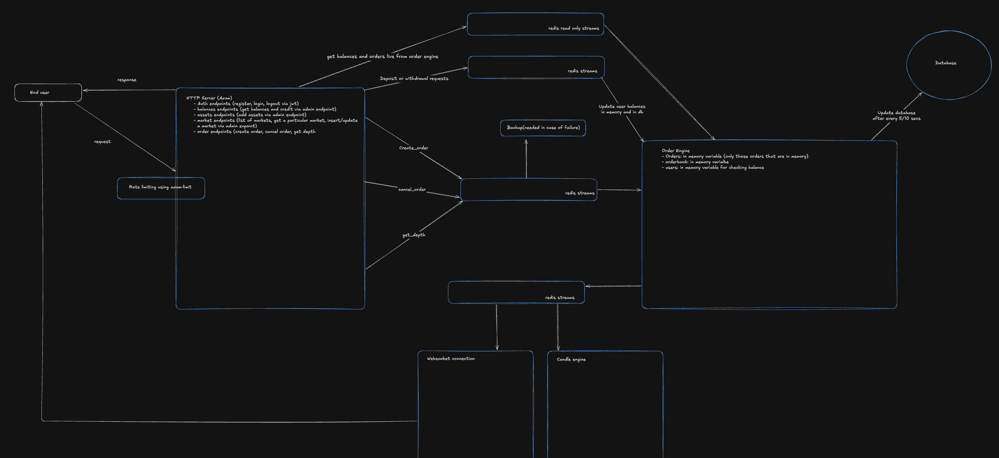

# PHEONIX

Spot CEX demo — in-memory matching, Redis command bus, Postgres for money & snapshots.

## Architecture



**Flow**

1. **Client** → HTTP API (auth, balances, markets, orders) + WebSocket (live book/trades)
2. **API** enqueues commands / queries on **Redis Streams** (rate-limited)
3. **Order engine** consumes streams, matches in memory, persists ledger intents to **Postgres**, publishes **exchange-events**
4. **WS server** and **candle builder** fan out from `exchange-events`
5. Engine **snapshots** open books/orders + stream cursors; restarts replay Redis after the last cursor

## Tech stack

| Layer | Tech |
|---|---|
| API / engine / WS / candles / demo bot | **Rust** (Axum, Tokio, SQLx) |
| Web desk | **Next.js** (Bun) |
| Command bus & fan-out | **Redis Streams** |
| Durable store | **Postgres** (balances, ledger, candles, engine snapshots) |
| Auth | JWT (access) + HttpOnly refresh cookie |
| Deploy | Docker Compose · Nginx · EC2 |

**Redis streams:** `order-commands` · `engine-commands` · `engine-queries` · `exchange-events`

## Local run

```bash
docker compose --profile demo up --build
```

- Web: `http://localhost:3001`
- API: `http://localhost:3000`
- WS: `ws://localhost:3002/ws`
